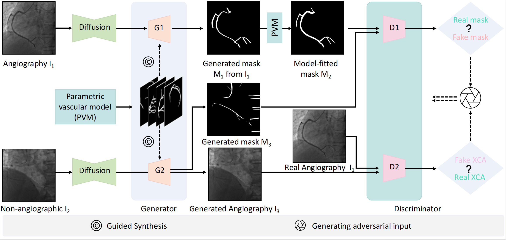

## Paper

This repository provides the official PyTorch implementation of our model in the following papers:

**[Unsupervised Blood Vessel Generation for Synthesizing Angiographic X-rays via Adversarial Diffusion Models](***)** <br/> 
[Zhifeng Wang](***), [Renjiao Yi](https://renjiaoyi.github.io/), [Xin Wen](***), [Chenyang Zhu](http://www.zhuchenyang.net/), [Kai Xu](https://kevinkaixu.net/), [Kunlun He](https://scholar.google.com/citations?user=31wT3skAAAAJ&hl=en) <br/>




## Abstract

Vascular diseases pose a significant threat to human health, with X-ray angiography established as the gold standard for diagnosis, allowing for detailed observation of blood vessels. However, angiographic X-rays expose personnel and patients to higher radiation levels than non-angiographic X-rays, which are unwanted. Thus, modality translation from non-angiographic to angiographic X-rays is desirable. However, data-driven deep approaches are hindered by the lack of paired large-scale X-ray angiography datasets, making high-quality vascular angiography synthesis crucial but challenging. We find that current medical image synthesis methods primarily operate at pixel level and struggle to adapt to the complex geometric structure of blood vessels, resulting in unsatisfactory quality of blood vessel image synthesis, such as disconnections or unnatural curvatures. To overcome this issue, we propose a self-supervised method via diffusion models to transform non-angiographic X-rays into angiographic X-rays, mitigating data shortages for data-driven approaches. Our model comprises a diffusion model that learns the distribution of vascular data from diffusion latent, a generator for vessel synthesis, and a mask-based adversarial module. 
To enhance geometric accuracy, we propose a parametric vascular model to fit the shape and distribution of blood vessels. The proposed method contributes a pipeline and a synthetic dataset for X-ray angiography. To validate the efficacy of the synthesized dataset of the proposed pipeline, we conduct experiments of training several vascular segmentation methods by adding the synthesized dataset into their training data and evaluating on an unseen dataset. It shows that the synthesized dataset successfully enhances the performance of several baseline models.

## Environment

We could ensure that the code is available in such environment.

  * OS : Ubuntu 18.04
  * Python >= 3.8
  * PyTorch >= 1.13.0


## Dataset

In this paper, we used the **[XCAD dataset](https://www.dropbox.com/scl/fi/mvstwdgxo0hfk678x94d4/XCAD.zip?rlkey=qdztml0gzfzoc0t5d16k71u76&e=1&dl=0)**  and the **[ARCADE dataset](https://zenodo.org/records/10390295)** for training. In the Blood vessel simulation part, we used the **[RPCA-UNet dataset](https://github.com/Binjie-Qin/RPCA-UNet)**.

## Train

```
python main.py -p train -c config/train.json
```

## Test

```
python main.py -p test -c config/test.json
```


<!-- ## Citation
If you use this code or use our pre-trained weights for your research, please cite our papers:

```
``` -->


```
